# Full Stack Portfolio

Personal developer portfolio and internship profile website for Areeba Murtaza.

## Overview

This project is a complete static multi-page site built with semantic HTML and custom CSS. It includes a home page, about/profile page, projects/skills page, contact/application form page, and a bonus roadmap page.

## Pages

- `index.html` - Home page
- `about.html` - About/profile page
- `projects.html` - Projects and skills page
- `contact.html` - Contact/application form page
- `roadmap.html` - Bonus roadmap page

## Features

- Shared navigation across all pages
- Semantic HTML structure with meaningful tags
- Fully styled responsive layout using custom CSS
- Prefilled contact/application form for screenshot-ready presentation
- Clean cards, timeline content, and project showcase sections

## Files

- `style.css` - Global styling for the entire site
- `index.html` - Portfolio landing page
- `about.html` - Personal profile and timeline
- `projects.html` - Project highlights and skills
- `contact.html` - Form and contact details
- `roadmap.html` - Learning roadmap and future goals

## How to run

1. Open the folder in VS Code.
2. Open `index.html` in your browser, or use Live Server if available.
3. Navigate through the pages using the top menu.

## Repository link

- GitHub repository: [https://github.com/areebamurtaza/fullstack-portfolio](https://github.com/areebamurtaza/fullstack-portfolio)

## Live link

-[ Live website: (https://areeba-fullstack-portfolio.netlify.app/)

## What I Revised (HTML Concepts)

1. **Semantic HTML structure** - Used proper HTML5 tags (header, nav, main, section, article, footer) for better document structure and accessibility
2. **Form validation attributes** - Added required, minlength, maxlength, pattern attributes to demonstrate proper form validation  
3. **Form field variety** - Used input types: text, email, tel, date, url, file; select dropdowns, textarea, radio buttons, checkboxes
4. **Fieldset and legend** - Organized form fields into logical groups with proper legend labels
5. **Datalist for autocomplete** - Implemented datalist for city input to show suggestions
6. **Details and summary** - Added interactive FAQ section with collapsible details/summary elements
7. **Definition lists** - Used dl, dt, dd tags for professional information on about page
8. **Blockquote and cite** - Added professional quote with proper blockquote tag
9. **Tables with semantics** - Created data table with caption, thead, tbody, th, td elements
10. **Address tag** - Used semantic address element for contact information

## Issues Faced & How I Fixed Them

1. **Issue: Organizing many form fields in a logical readable way**
   - *Solution:* Used fieldsets with legends to group related fields (Personal Details, Internship Details, Bio, Links), and CSS Grid to organize inputs into 2 columns. Added visual hierarchy with proper spacing and indentation.

2. **Issue: Creating interactive FAQ without JavaScript**
   - *Solution:* Used HTML5 `
` and `
` elements which provide native toggle/collapse functionality without requiring any JavaScript code.

3. **Issue: Ensuring form looks complete for screenshot demonstration**
   - *Solution:* Added realistic sample data using value attributes on all input fields and textareas, matching the student profile. Included all required fields: phone pattern validation, date inputs, radio buttons for gender/work mode, file upload for CV.

4. **Issue: Mobile responsiveness for complex form layout**
   - *Solution:* Used CSS media queries to convert 2-column form grid to single column on screens < 720px. Also adjusted fieldset padding and legend styling to save space on mobile.

5. **Issue: Meeting the 25+ meaningful HTML tags requirement**
   - *Solution:* Carefully selected tags that serve semantic purpose - header, nav, main, section, article, aside, footer, h1-h4, p, a, ul, ol, li, dl, dt, dd, table, thead, tbody, tr, th, td, form, fieldset, legend, label, input, select, textarea, button, details, summary, pre, code, blockquote, address, figure, figcaption, time, progress, meter. Each tag adds structural meaning, not just bulk.

## Screenshots

- Home page screenshot
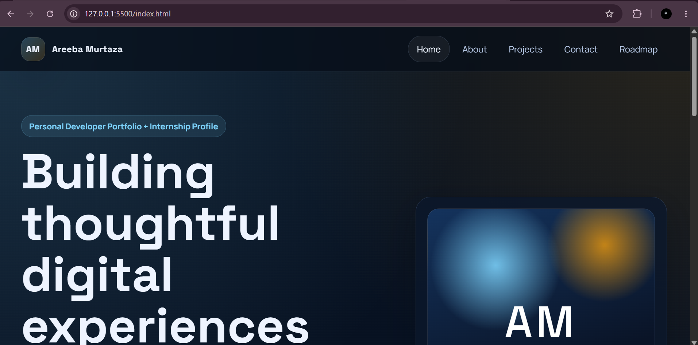 

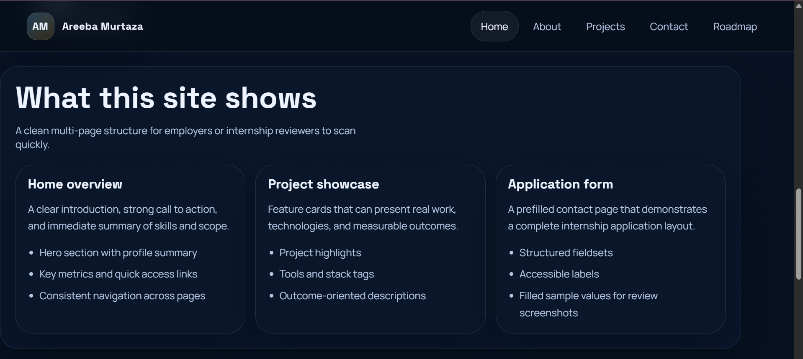 

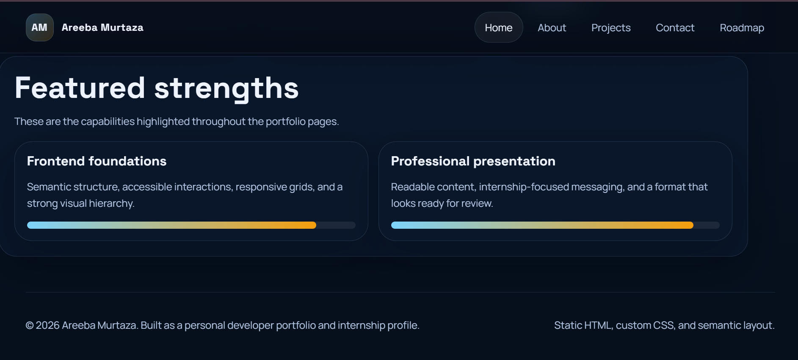 

- About page screenshot
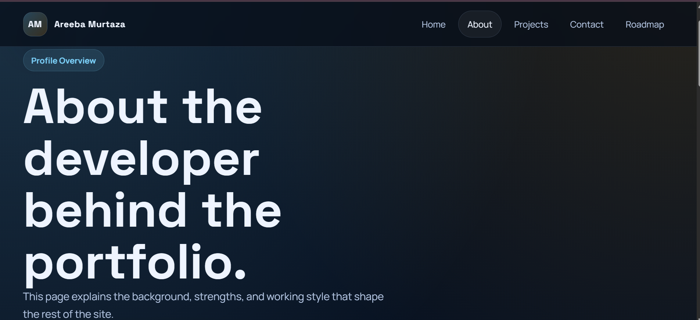
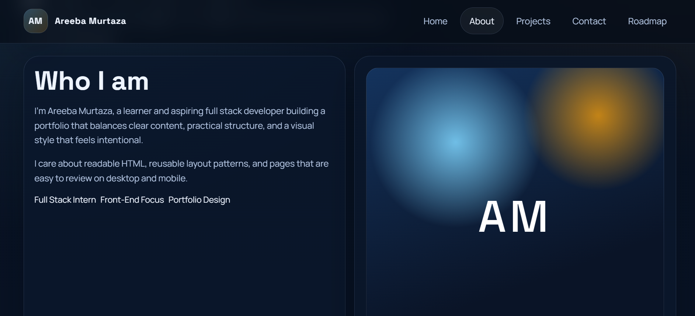
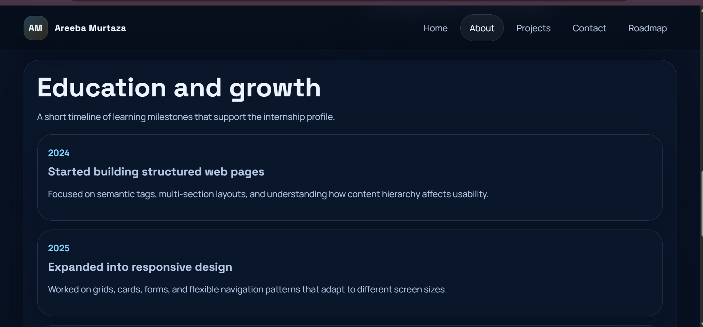
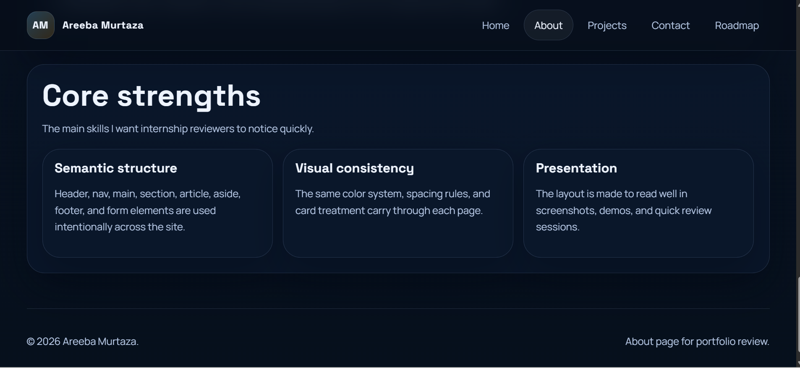

- Projects page screenshot
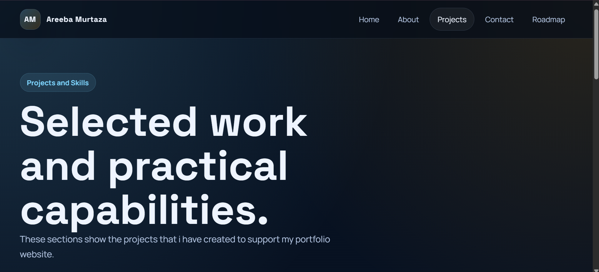
 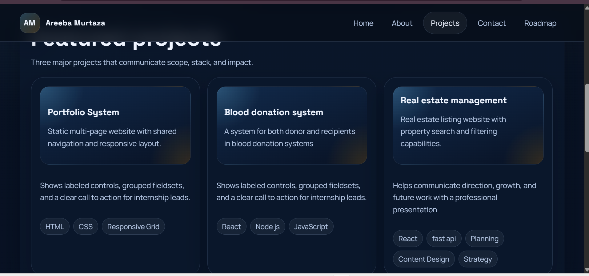
 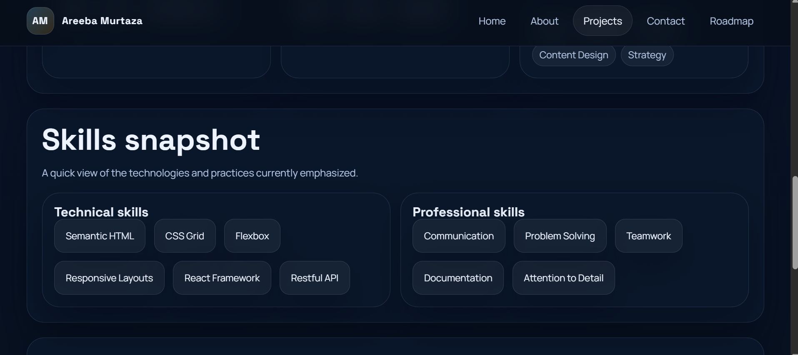
 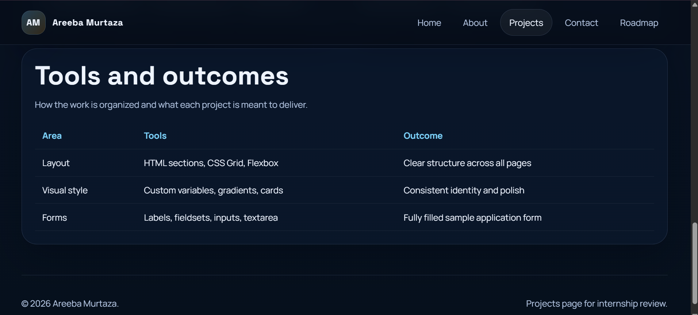
 

- Filled contact form screenshot
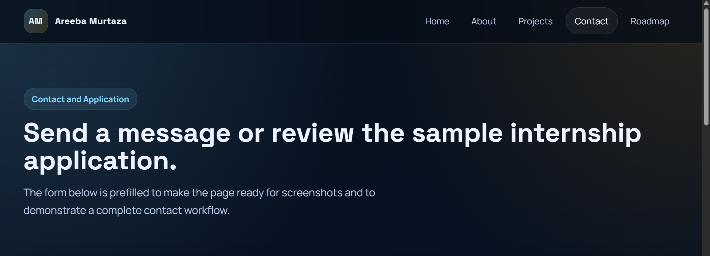
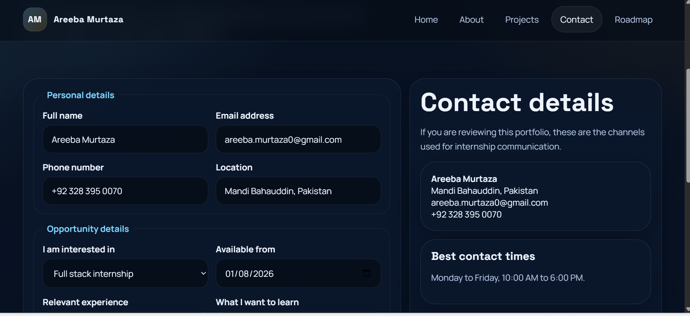
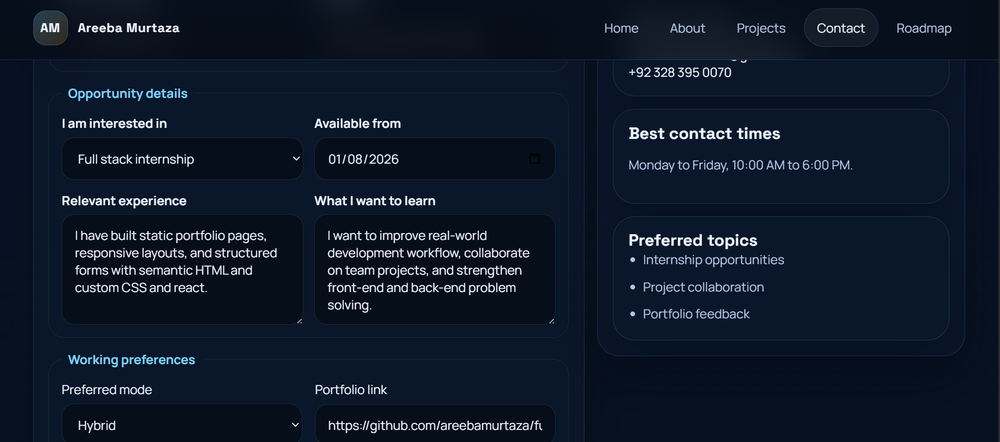

## Notes

- The contact form is prefilled to demonstrate a complete application layout.
- The site uses only static HTML and CSS, so it can be hosted on GitHub Pages or any static hosting service.
